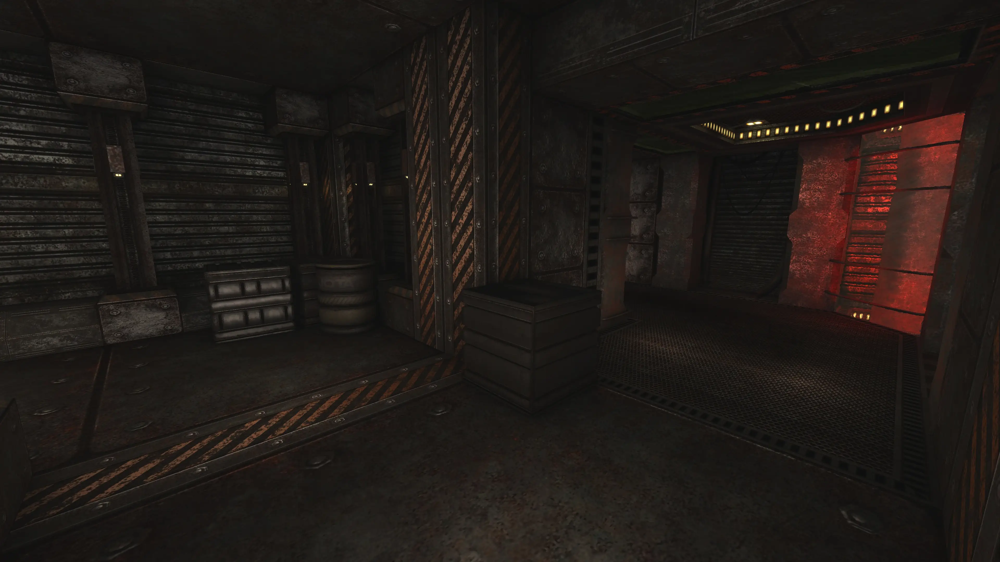
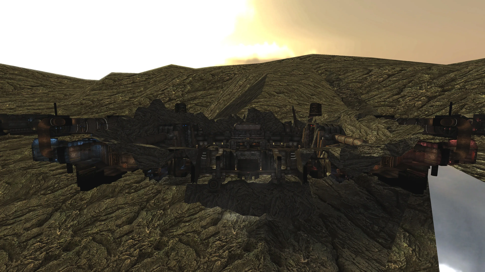

# Jota - Game Level For Unvanquished
 

## Overview: A haunting gas harvesting platform in the clouds
Jota is a game level by Matthias "Masmblr" Peters for the open source game [_Unvanquished_](https://Unvanquished.net/).

##  Description: 
   Originally developed for Tremulous, this map is now also available for Unvanquished. The map has been completely overhauled, including more details, revamped and newly created textures, shaders, particle systems, and sounds. The lighting has been improved to create a more cohesive atmosphere. Since this is a symmetrical map, care was taken to distinguish the two sides—Humans and Aliens—by color. The Human side is bathed in a bluish light, while the Alien side is immersed in red, helping players quickly identify their location.

   The architecture is now more detailed, with an increased number of decals to make the environment feel more realistic. The terrain has a more organic shape, reflected in the skybox, which now features a large terrain to enhance immersion. Below the terrain, there's a large cone with a special shader applied, creating the impression that gas is emanating from beneath the Jota Station. Gas effects have been implemented in several locations using multiple particle systems, along with electric sparks and direct lights that add flickering effects to certain scenes. The large crane in the center now swings, and the massive gas balloon moves up and down.

   At the end of each round, a haze particle system is activated, accompanied by an emergency sound signaling the round's conclusion. The water has been enhanced with a haze shader layer, making it appear more realistic. These haze effects can also be found in a section of the rock textures where water runs down the wall, and in the glass textures, where the light is now more strongly distorted when viewed through. Props like boxes and barrels have been reworked, now featuring more detail and new textures. The soundscape has been adjusted to fit the environment—fans create a wind noise, gas pipes hum, and computers make their typical sounds.

   Overall, there are many new features in this map that I'm very satisfied with. Have fun playing!

 * * *

    Changelog:
    
    05.07.2015: v0.1
    -Initial alpha release
    
    30.08.2015: v1.0
    -Texture / Brush errors fixed
    -Colorgrading added
    -Reverb effect added
    -Added navmeshes support
    -Extended map geometry
    -License updated

    26.09.2015: v2.0
    -Extended map geometry
    -Entity cleanup
    -Texture / Brush errors fixed
    -Colorgrading changed
    -Navmeshes updated
    -New textures and sounds
    -License updated

    08.08.2015: v3.0
    -Overhauled textures, shaders, and particle systems
    -Improved lighting
    -Improved detailed architecture 
    -Increased number of decals
    -Organic terrain shape and expanded skybox
    -More particle systems
    -Enhanced shaders
    -Swinging crane and moving gas balloon
    -Game-Over-Scene added
    -Reworked props with new textures
    -Adjusted soundscape
    -Bugfixes..
    -License updated

 * * *

## Screenshots:

## History:
| Version: | Date:        | Status: |    
| ------- | ------------- | ------: | 
| 0.1    | 05/07/2015  | alpha |
| 1.0    | 30/08/2015  | beta |
| 2.0    | 26/09/2015  | beta |
| 3.0    | 08/08/2024  | beta |

## Development Tools:
[GIMP](https://www.gimp.org/) \
[Photoshop](https://www.adobe.com/de/products/photoshop.html) \
[Audacity](https://www.audacityteam.org/) \
[NetRadiant](https://netradiant.gitlab.io/) (v1.5.0-20220628) \
[Q3Map2](http://q3map2.robotrenegade.com/) \
[Notepad++](https://notepad-plus-plus.org/) \
[Visual Studio Code](https://code.visualstudio.com/)

## Thanks to:
* id Software for Quake3
* Team Xonotic for NetRadiant 
* Unvanquished Development for Unvanquished

## Related Resources:
Unvanquished website: https://unvanquished.net \
NetRadiant Level-Editor: https://netradiant.gitlab.io \
Unvanquished-Mapping Wiki: https://wiki.unvanquished.net/wiki/Mapping \
Quake3 Shader Manual: http://toolz.nexuizninjaz.com/shader/ \
Quake3 advanced Map-Compiler: http://q3map2.robotrenegade.com \
Excellent source of various sounds: https://freesound.org

## Credits - Legal Information and Attribution
Below is a list of files along with their legal statuses. For detailed license information,
please refer to the LICENSE file or the provided link. Works that incorporate elements
influenced by other pieces are indicated with an asterisk (*) at the end, followed by the original author.

The following files are published by Matthias “Masmblr” Peters (masmblr@gmail.com)
under the CC BY 4.0 - Attribution 4.0 International license:
   
DEPS \
LICENSE \
README \
VERSION \
readme_meta\\...  \
about\map-jota.txt  \
maps\jota.map \
meta\jota\jota.arena \
models\jota\skybox_d0ome.mtl \
models\jota\skybox_dome.obj \
scripts\jota_custom.particle \
scripts\jota_custom.shader \
scripts\jota_custom.trail \
scripts\shaderlist.txt \
sounds\jota\computer_sounds.opus * (https://freesound.org/people/newlocknew, Attribution 4.0) \
sounds\jota\computer_work.opus * (https://freesound.org/people/suonidigenova, Creative Commons 0) \
sounds\jota\electric_01.opus * (https://freesound.org/people/chimerical, Attribution 4.0) \
sounds\jota\electric_02.opus * (https://freesound.org/people/chimerical, Attribution 4.0) \
sounds\jota\fan_slow.opus * (https://freesound.org/people/newlocknew, Attribution 4.0) \
sounds\jota\game_over.opus * (https://freesound.org/people/Leadershinji, Attribution 4.0; https://freesound.org/people/onderwish, Creative Commons 0;
https://freesound.org/people/HaraldDeLuca, Attribution NonCommercial 4.0; https://freesound.org/people/xdrav, Creative Commons 0; https://freesound.org/people/Anomaex, Creative Commons 0;)
sounds\jota\levelwide_rumble.opus * (https://freesound.org/people/newlocknew), Attribution 4.0) \
sounds\jota\lift.opus * (https://freesound.org/people/newlocknew), Attribution 4.0) \
sounds\jota\machine_sound_high.opus * (https://freesound.org/people/newlocknew), Attribution 4.0) \
sounds\jota\machine_sound_low.opus * (https://freesound.org/people/newlocknew), Attribution 4.0) \
sounds\jota\moving_gears.opus * (https://freesound.org/people/Erdie, Attribution 4.0) \
sounds\jota\pipe_steam.opus * (https://freesound.org/people/newlocknew), Attribution 4.0) \
sounds\jota\window_rumble.opus * (https://freesound.org/people/newlocknew), Attribution 4.0) \
sounds\jota\wind_loop.opus * (https://freesound.org/people/warwickallison, Attribution 3.0) \
textures\jota_custom_src\decal_19_d.webp * (https://www.unvanquished.net), GNU GPLv3, CC BY-SA 2.5) \
gfx\jota\colorgrading.webp * (https://www.unvanquished.net), GNU GPLv3, CC BY-SA 2.5) \
textures\jota_custom_src\balloon_fabric_01_d.webp \
textures\jota_custom_src\balloon_fabric_01_n.webp \
textures\jota_custom_src\balloon_fabric_01_s.webp \
textures\jota_custom_src\balloon_fabric_02_d.webp \
textures\jota_custom_src\balloon_fabric_02_envmap.webp \
textures\jota_custom_src\barrel_01_d.webp \
textures\jota_custom_src\barrel_01_h.webp \
textures\jota_custom_src\barrel_01_n.webp \
textures\jota_custom_src\barrel_01_s.webp \
textures\jota_custom_src\barrel_red_01_d.webp \
textures\jota_custom_src\barrel_red_top_01_d.webp \
textures\jota_custom_src\barrel_top_01_d.webp \
textures\jota_custom_src\barrel_top_01_h.webp \
textures\jota_custom_src\barrel_top_01_n.webp \
textures\jota_custom_src\barrel_top_01_s.webp \
textures\jota_custom_src\barrel_top_white_01_d.webp \
textures\jota_custom_src\barrel_warn_01_d.webp \
textures\jota_custom_src\barrel_yellow_01_d.webp \
textures\jota_custom_src\barrel_yellow_top_01_d.webp \
textures\jota_custom_src\box_01_d.webp \
textures\jota_custom_src\box_01_n.webp \
textures\jota_custom_src\box_01_s.webp \
textures\jota_custom_src\box_02_d.webp \
textures\jota_custom_src\box_02_n.webp \
textures\jota_custom_src\box_02_s.webp \
textures\jota_custom_src\box_03_d.webp \
textures\jota_custom_src\box_03_n.webp \
textures\jota_custom_src\box_03_s.webp \
textures\jota_custom_src\cables_01_d.webp \
textures\jota_custom_src\cables_01_n.webp \
textures\jota_custom_src\cables_01_s.webp \
textures\jota_custom_src\decal_01_d.webp \
textures\jota_custom_src\decal_02_d.webp \
textures\jota_custom_src\decal_03_d.webp \
textures\jota_custom_src\decal_04_d.webp \
textures\jota_custom_src\decal_05_d.webp \
textures\jota_custom_src\decal_06_d.webp \
textures\jota_custom_src\decal_07_d.webp \
textures\jota_custom_src\decal_08_d.webp \
textures\jota_custom_src\decal_09_d.webp \
textures\jota_custom_src\decal_10_d.webp \
textures\jota_custom_src\decal_11_d.webp \
textures\jota_custom_src\decal_12_d.webp \
textures\jota_custom_src\decal_13_d.webp \
textures\jota_custom_src\decal_14_d.webp \
textures\jota_custom_src\decal_15_d.webp \
textures\jota_custom_src\decal_16_d.webp \
textures\jota_custom_src\decal_17_d.webp \
textures\jota_custom_src\decal_18_d.webp \
textures\jota_custom_src\glas_01_d.webp \
textures\jota_custom_src\glas_02_hhm.webp \
textures\jota_custom_src\light_01_d.webp \
textures\jota_custom_src\light_01_g.webp \
textures\jota_custom_src\light_01_n.webp \
textures\jota_custom_src\light_01_s.webp \
textures\jota_custom_src\light_02_blue_d.webp \
textures\jota_custom_src\light_02_blue_g.webp \
textures\jota_custom_src\light_02_d.webp \
textures\jota_custom_src\light_02_g.webp \
textures\jota_custom_src\light_02_n.webp \
textures\jota_custom_src\light_02_red_d.webp \
textures\jota_custom_src\light_02_red_g.webp \
textures\jota_custom_src\light_02_s.webp \
textures\jota_custom_src\light_03_blue_d.webp \
textures\jota_custom_src\light_03_blue_g.webp \
textures\jota_custom_src\light_03_h.webp \
textures\jota_custom_src\light_03_n.webp \
textures\jota_custom_src\light_03_red_d.webp \
textures\jota_custom_src\light_03_red_g.webp \
textures\jota_custom_src\light_03_s.webp \
textures\jota_custom_src\light_05_d.webp \
textures\jota_custom_src\light_05_g.webp \
textures\jota_custom_src\light_05_n.webp \
textures\jota_custom_src\light_05_s.webp \
textures\jota_custom_src\light_05_stream_g.webp \
textures\jota_custom_src\metal_01_d.webp \
textures\jota_custom_src\metal_01_glow_0_d.webp \
textures\jota_custom_src\metal_01_glow_0_g.webp \
textures\jota_custom_src\metal_01_glow_1_d.webp \
textures\jota_custom_src\metal_01_glow_1_g.webp \
textures\jota_custom_src\metal_01_glow_2_d.webp \
textures\jota_custom_src\metal_01_glow_2_g.webp \
textures\jota_custom_src\metal_01_glow_n.webp \
textures\jota_custom_src\metal_01_glow_s.webp \
textures\jota_custom_src\metal_01_n.webp \
textures\jota_custom_src\metal_01_s.webp \
textures\jota_custom_src\metal_02_d.webp \
textures\jota_custom_src\metal_02_n.webp \
textures\jota_custom_src\metal_02_s.webp \
textures\jota_custom_src\metal_03_d.webp \
textures\jota_custom_src\metal_03_n.webp \
textures\jota_custom_src\metal_03_s.webp \
textures\jota_custom_src\rocks_01_d.webp \
textures\jota_custom_src\rocks_01_hhm.webp \
textures\jota_custom_src\rocks_01_n.webp \
textures\jota_custom_src\rocks_01_s.webp \
textures\jota_custom_src\rotor_blades_01_d.webp \
textures\jota_custom_src\rotor_blades_01_n.webp \
textures\jota_custom_src\rotor_blades_01_s.webp \
textures\jota_custom_src\screen_01_d.webp \
textures\jota_custom_src\screen_01_g.webp \
textures\jota_custom_src\screen_01_scanlines.webp \
textures\jota_custom_src\screen_02_d.webp \
textures\jota_custom_src\sfx_airstream_d.webp \
textures\jota_custom_src\sfx_airstream_hhm.webp \
textures\jota_custom_src\sfx_distortion_hhm.webp \
textures\jota_custom_src\sfx_envmap.webp \
textures\jota_custom_src\sfx_envmap_2.webp \
textures\jota_custom_src\sfx_envmap_3.webp \
textures\jota_custom_src\sfx_gradient_blue_01_d.webp \
textures\jota_custom_src\sfx_gradient_red_01_d.webp \
textures\jota_custom_src\sfx_gradient_white_01_d.webp \
textures\jota_custom_src\sfx_skybox_atmopshere.webp \
textures\jota_custom_src\sfx_sprite_01_d.webp \
textures\jota_custom_src\sfx_sprite_02_d.webp \
textures\jota_custom_src\sfx_sprite_03_d.webp \
textures\jota_custom_src\sfx_sprite_04_d.webp \
textures\jota_custom_src\sfx_sprite_blue_01_d.webp \
textures\jota_custom_src\sfx_sprite_red_01_d.webp \
textures\jota_custom_src\sfx_trail_01_d.webp \
textures\jota_custom_src\sfx_trail_02_d.webp \
textures\jota_custom_src\sfx_trail_03_d.webp \
textures\jota_custom_src\turn_wheel_01_d.webp \
textures\jota_custom_src\turn_wheel_01_n.webp \
textures\jota_custom_src\turn_wheel_01_s.webp \
textures\jota_custom_src\water_01_d.webp \
textures\jota_custom_src\water_01_hhm.webp \
textures\jota_custom_src\qer_related\
textures\jota_custom_src\qer_related\hide_fog.webp \
textures\jota_custom_src\qer_related\qer_light_05_d.webp \
textures\jota_custom_src\qer_related\rocks_01_d_dir.webp \
textures\jota_custom_src\qer_related\sfx_skybox_dir.webp \
textures\jota_custom_src\qer_related\water_01_d_dir.webp \
env\jota\jota_bk.webp * (Jockum Skoglund (hipshot), CC-BY 3.0) \
env\jota\jota_dn.webp * (Jockum Skoglund (hipshot), CC-BY 3.0) \
env\jota\jota_ft.webp * (Jockum Skoglund (hipshot), CC-BY 3.0) \
env\jota\jota_lf.webp * (Jockum Skoglund (hipshot), CC-BY 3.0) \
env\jota\jota_rt.webp * (Jockum Skoglund (hipshot), CC-BY 3.0) \
env\jota\jota_up.webp * (Jockum Skoglund (hipshot), CC-BY 3.0) \
textures\jota_custom_src\exm_door_01_d.webp * ([Yves Allaire](http://www.evillair.net/), Creative Commons Attribution-ShareAlike 4.0 International) \
textures\jota_custom_src\exm_door_01_h.webp * ([Yves Allaire](http://www.evillair.net/), Creative Commons Attribution-ShareAlike 4.0 International) \
textures\jota_custom_src\exm_door_01_n.webp * ([Yves Allaire](http://www.evillair.net/), Creative Commons Attribution-ShareAlike 4.0 International) \
textures\jota_custom_src\exm_door_01_s.webp * ([Yves Allaire](http://www.evillair.net/), Creative Commons Attribution-ShareAlike 4.0 International) \
textures\jota_custom_src\exm_light_01_d.webp * ([Yves Allaire](http://www.evillair.net/), Creative Commons Attribution-ShareAlike 4.0 International) \
textures\jota_custom_src\exm_light_01_g.webp * ([Yves Allaire](http://www.evillair.net/), Creative Commons Attribution-ShareAlike 4.0 International) \
textures\jota_custom_src\exm_light_01_n.webp * ([Yves Allaire](http://www.evillair.net/), Creative Commons Attribution-ShareAlike 4.0 International) \
textures\jota_custom_src\exm_light_01_s.webp * ([Yves Allaire](http://www.evillair.net/), Creative Commons Attribution-ShareAlike 4.0 International) \
textures\jota_custom_src\exm_metal_00_d.webp * ([Yves Allaire](http://www.evillair.net/), Creative Commons Attribution-ShareAlike 4.0 International) \
textures\jota_custom_src\exm_metal_00_n.webp * ([Yves Allaire](http://www.evillair.net/), Creative Commons Attribution-ShareAlike 4.0 International) \
textures\jota_custom_src\exm_metal_00_s.webp * ([Yves Allaire](http://www.evillair.net/), Creative Commons Attribution-ShareAlike 4.0 International) \
textures\jota_custom_src\exm_metal_01_d.webp * ([Yves Allaire](http://www.evillair.net/), Creative Commons Attribution-ShareAlike 4.0 International) \
textures\jota_custom_src\exm_metal_01_n.webp * ([Yves Allaire](http://www.evillair.net/), Creative Commons Attribution-ShareAlike 4.0 International) \
textures\jota_custom_src\exm_metal_01_s.webp * ([Yves Allaire](http://www.evillair.net/), Creative Commons Attribution-ShareAlike 4.0 International) \
textures\jota_custom_src\exm_metal_02_d.webp * ([Yves Allaire](http://www.evillair.net/), Creative Commons Attribution-ShareAlike 4.0 International) \
textures\jota_custom_src\exm_metal_02_n.webp * ([Yves Allaire](http://www.evillair.net/), Creative Commons Attribution-ShareAlike 4.0 International) \
textures\jota_custom_src\exm_metal_02_s.webp * ([Yves Allaire](http://www.evillair.net/), Creative Commons Attribution-ShareAlike 4.0 International) \
textures\jota_custom_src\exm_metal_03_d.webp * ([Yves Allaire](http://www.evillair.net/), Creative Commons Attribution-ShareAlike 4.0 International) \
textures\jota_custom_src\exm_metal_03_n.webp * ([Yves Allaire](http://www.evillair.net/), Creative Commons Attribution-ShareAlike 4.0 International) \
textures\jota_custom_src\exm_metal_03_s.webp * ([Yves Allaire](http://www.evillair.net/), Creative Commons Attribution-ShareAlike 4.0 International) \
textures\jota_custom_src\exm_metal_04_d.webp * ([Yves Allaire](http://www.evillair.net/), Creative Commons Attribution-ShareAlike 4.0 International) \
textures\jota_custom_src\exm_metal_04_n.webp * ([Yves Allaire](http://www.evillair.net/), Creative Commons Attribution-ShareAlike 4.0 International) \
textures\jota_custom_src\exm_metal_04_s.webp * ([Yves Allaire](http://www.evillair.net/), Creative Commons Attribution-ShareAlike 4.0 International) \
textures\jota_custom_src\exm_metal_05_d.webp * ([Yves Allaire](http://www.evillair.net/), Creative Commons Attribution-ShareAlike 4.0 International) \
textures\jota_custom_src\exm_metal_05_n.webp * ([Yves Allaire](http://www.evillair.net/), Creative Commons Attribution-ShareAlike 4.0 International) \
textures\jota_custom_src\exm_metal_05_s.webp * ([Yves Allaire](http://www.evillair.net/), Creative Commons Attribution-ShareAlike 4.0 International) \
textures\jota_custom_src\exm_metal_06_d.webp * ([Yves Allaire](http://www.evillair.net/), Creative Commons Attribution-ShareAlike 4.0 International) \
textures\jota_custom_src\exm_metal_06_h.webp * ([Yves Allaire](http://www.evillair.net/), Creative Commons Attribution-ShareAlike 4.0 International) \
textures\jota_custom_src\exm_metal_06_n.webp * ([Yves Allaire](http://www.evillair.net/), Creative Commons Attribution-ShareAlike 4.0 International) \
textures\jota_custom_src\exm_metal_06_s.webp * ([Yves Allaire](http://www.evillair.net/), Creative Commons Attribution-ShareAlike 4.0 International) \
textures\jota_custom_src\exm_metal_06_shaft_d.webp * ([Yves Allaire](http://www.evillair.net/), Creative Commons Attribution-ShareAlike 4.0 International) \
textures\jota_custom_src\exm_metal_07_d.webp * ([Yves Allaire](http://www.evillair.net/), Creative Commons Attribution-ShareAlike 4.0 International) \
textures\jota_custom_src\exm_metal_07_h.webp * ([Yves Allaire](http://www.evillair.net/), Creative Commons Attribution-ShareAlike 4.0 International) \
textures\jota_custom_src\exm_metal_07_n.webp * ([Yves Allaire](http://www.evillair.net/), Creative Commons Attribution-ShareAlike 4.0 International) \
textures\jota_custom_src\exm_metal_07_s.webp * ([Yves Allaire](http://www.evillair.net/), Creative Commons Attribution-ShareAlike 4.0 International) \
textures\jota_custom_src\exm_metal_08_d.webp * ([Yves Allaire](http://www.evillair.net/), Creative Commons Attribution-ShareAlike 4.0 International) \
textures\jota_custom_src\exm_metal_08_h.webp * ([Yves Allaire](http://www.evillair.net/), Creative Commons Attribution-ShareAlike 4.0 International) \
textures\jota_custom_src\exm_metal_08_n.webp * ([Yves Allaire](http://www.evillair.net/), Creative Commons Attribution-ShareAlike 4.0 International) \
textures\jota_custom_src\exm_metal_08_s.webp * ([Yves Allaire](http://www.evillair.net/), Creative Commons Attribution-ShareAlike 4.0 International) \
textures\jota_custom_src\exm_metal_09_d.webp * ([Yves Allaire](http://www.evillair.net/), Creative Commons Attribution-ShareAlike 4.0 International) \
textures\jota_custom_src\exm_metal_09_h.webp * ([Yves Allaire](http://www.evillair.net/), Creative Commons Attribution-ShareAlike 4.0 International) \
textures\jota_custom_src\exm_metal_09_n.webp * ([Yves Allaire](http://www.evillair.net/), Creative Commons Attribution-ShareAlike 4.0 International) \
textures\jota_custom_src\exm_metal_09_s.webp * ([Yves Allaire](http://www.evillair.net/), Creative Commons Attribution-ShareAlike 4.0 International) \
textures\jota_custom_src\exm_metal_10_d.webp * ([Yves Allaire](http://www.evillair.net/), Creative Commons Attribution-ShareAlike 4.0 International) \
textures\jota_custom_src\exm_metal_10_n.webp * ([Yves Allaire](http://www.evillair.net/), Creative Commons Attribution-ShareAlike 4.0 International) \
textures\jota_custom_src\exm_metal_10_s.webp * ([Yves Allaire](http://www.evillair.net/), Creative Commons Attribution-ShareAlike 4.0 International) \
textures\jota_custom_src\exm_metal_11_d.webp * ([Yves Allaire](http://www.evillair.net/), Creative Commons Attribution-ShareAlike 4.0 International) \
textures\jota_custom_src\exm_metal_11_n.webp * ([Yves Allaire](http://www.evillair.net/), Creative Commons Attribution-ShareAlike 4.0 International) \
textures\jota_custom_src\exm_metal_11_s.webp * ([Yves Allaire](http://www.evillair.net/), Creative Commons Attribution-ShareAlike 4.0 International) \
textures\jota_custom_src\exm_metal_12_d.webp * ([Yves Allaire](http://www.evillair.net/), Creative Commons Attribution-ShareAlike 4.0 International) \
textures\jota_custom_src\exm_metal_12_n.webp * ([Yves Allaire](http://www.evillair.net/), Creative Commons Attribution-ShareAlike 4.0 International) \
textures\jota_custom_src\exm_metal_12_s.webp * ([Yves Allaire](http://www.evillair.net/), Creative Commons Attribution-ShareAlike 4.0 International) \
textures\jota_custom_src\exm_metal_13_d.webp * ([Yves Allaire](http://www.evillair.net/), Creative Commons Attribution-ShareAlike 4.0 International) \
textures\jota_custom_src\exm_metal_13_jota_d.webp * ([Yves Allaire](http://www.evillair.net/), Creative Commons Attribution-ShareAlike 4.0 International) \
textures\jota_custom_src\exm_metal_13_jota_s.webp * ([Yves Allaire](http://www.evillair.net/), Creative Commons Attribution-ShareAlike 4.0 International) \
textures\jota_custom_src\exm_metal_13_n.webp * ([Yves Allaire](http://www.evillair.net/), Creative Commons Attribution-ShareAlike 4.0 International) \
textures\jota_custom_src\exm_metal_13_s.webp * ([Yves Allaire](http://www.evillair.net/), Creative Commons Attribution-ShareAlike 4.0 International) \
textures\jota_custom_src\exm_metal_14_d.webp * ([Yves Allaire](http://www.evillair.net/), Creative Commons Attribution-ShareAlike 4.0 International) \
textures\jota_custom_src\exm_metal_14_n.webp * ([Yves Allaire](http://www.evillair.net/), Creative Commons Attribution-ShareAlike 4.0 International) \
textures\jota_custom_src\exm_metal_14_s.webp * ([Yves Allaire](http://www.evillair.net/), Creative Commons Attribution-ShareAlike 4.0 International) \
textures\jota_custom_src\exm_metal_15_d.webp * ([Yves Allaire](http://www.evillair.net/), Creative Commons Attribution-ShareAlike 4.0 International) \
textures\jota_custom_src\exm_metal_15_n.webp * ([Yves Allaire](http://www.evillair.net/), Creative Commons Attribution-ShareAlike 4.0 International) \
textures\jota_custom_src\exm_metal_15_s.webp * ([Yves Allaire](http://www.evillair.net/), Creative Commons Attribution-ShareAlike 4.0 International) \
textures\jota_custom_src\exm_metal_16_d.webp * ([Yves Allaire](http://www.evillair.net/), Creative Commons Attribution-ShareAlike 4.0 International) \
textures\jota_custom_src\exm_metal_16_h.webp * ([Yves Allaire](http://www.evillair.net/), Creative Commons Attribution-ShareAlike 4.0 International) \
textures\jota_custom_src\exm_metal_16_n.webp * ([Yves Allaire](http://www.evillair.net/), Creative Commons Attribution-ShareAlike 4.0 International) \
textures\jota_custom_src\exm_metal_16_s.webp * ([Yves Allaire](http://www.evillair.net/), Creative Commons Attribution-ShareAlike 4.0 International) \
textures\jota_custom_src\exm_metal_17_d.webp * ([Yves Allaire](http://www.evillair.net/), Creative Commons Attribution-ShareAlike 4.0 International) \
textures\jota_custom_src\exm_metal_17_n.webp * ([Yves Allaire](http://www.evillair.net/), Creative Commons Attribution-ShareAlike 4.0 International) \
textures\jota_custom_src\exm_metal_17_s.webp * ([Yves Allaire](http://www.evillair.net/), Creative Commons Attribution-ShareAlike 4.0 International) \
textures\jota_custom_src\exm_metal_18_d.webp * ([Yves Allaire](http://www.evillair.net/), Creative Commons Attribution-ShareAlike 4.0 International) \
textures\jota_custom_src\exm_metal_18_n.webp * ([Yves Allaire](http://www.evillair.net/), Creative Commons Attribution-ShareAlike 4.0 International) \
textures\jota_custom_src\exm_metal_18_s.webp * ([Yves Allaire](http://www.evillair.net/), Creative Commons Attribution-ShareAlike 4.0 International) \
textures\jota_custom_src\exm_metal_19_d.webp * ([Yves Allaire](http://www.evillair.net/), Creative Commons Attribution-ShareAlike 4.0 International) \
textures\jota_custom_src\exm_metal_19_n.webp * ([Yves Allaire](http://www.evillair.net/), Creative Commons Attribution-ShareAlike 4.0 International) \
textures\jota_custom_src\exm_metal_19_s.webp * ([Yves Allaire](http://www.evillair.net/), Creative Commons Attribution-ShareAlike 4.0 International) \
textures\jota_custom_src\exm_metal_20_d.webp * ([Yves Allaire](http://www.evillair.net/), Creative Commons Attribution-ShareAlike 4.0 International) \
textures\jota_custom_src\exm_metal_20_n.webp * ([Yves Allaire](http://www.evillair.net/), Creative Commons Attribution-ShareAlike 4.0 International) \
textures\jota_custom_src\exm_metal_20_s.webp * ([Yves Allaire](http://www.evillair.net/), Creative Commons Attribution-ShareAlike 4.0 International) \
textures\jota_custom_src\exm_metal_21_d.webp * ([Yves Allaire](http://www.evillair.net/), Creative Commons Attribution-ShareAlike 4.0 International) \
textures\jota_custom_src\exm_metal_21_n.webp * ([Yves Allaire](http://www.evillair.net/), Creative Commons Attribution-ShareAlike 4.0 International) \
textures\jota_custom_src\exm_metal_21_s.webp * ([Yves Allaire](http://www.evillair.net/), Creative Commons Attribution-ShareAlike 4.0 International) \
textures\jota_custom_src\exm_metal_23_d.webp * ([Yves Allaire](http://www.evillair.net/), Creative Commons Attribution-ShareAlike 4.0 International) \
textures\jota_custom_src\exm_metal_23_n.webp * ([Yves Allaire](http://www.evillair.net/), Creative Commons Attribution-ShareAlike 4.0 International) \
textures\jota_custom_src\exm_metal_23_s.webp * ([Yves Allaire](http://www.evillair.net/), Creative Commons Attribution-ShareAlike 4.0 International) \
textures\jota_custom_src\exm_metal_26_n.webp * ([Yves Allaire](http://www.evillair.net/), Creative Commons Attribution-ShareAlike 4.0 International) \
textures\jota_custom_src\exm_metal_26_s.webp * ([Yves Allaire](http://www.evillair.net/), Creative Commons Attribution-ShareAlike 4.0 International) \
textures\jota_custom_src\exm_metal_27_d.webp * ([Yves Allaire](http://www.evillair.net/), Creative Commons Attribution-ShareAlike 4.0 International) \
textures\jota_custom_src\exm_metal_27_n.webp * ([Yves Allaire](http://www.evillair.net/), Creative Commons Attribution-ShareAlike 4.0 International) \
textures\jota_custom_src\exm_metal_27_s.webp * ([Yves Allaire](http://www.evillair.net/), Creative Commons Attribution-ShareAlike 4.0 International) \
textures\jota_custom_src\exm_metal_28_d.webp * ([Yves Allaire](http://www.evillair.net/), Creative Commons Attribution-ShareAlike 4.0 International) \
textures\jota_custom_src\exm_metal_28_n.webp * ([Yves Allaire](http://www.evillair.net/), Creative Commons Attribution-ShareAlike 4.0 International) \
textures\jota_custom_src\exm_metal_28_s.webp * ([Yves Allaire](http://www.evillair.net/), Creative Commons Attribution-ShareAlike 4.0 International) \
textures\jota_custom_src\exm_metal_29_d.webp * ([Yves Allaire](http://www.evillair.net/), Creative Commons Attribution-ShareAlike 4.0 International) \
textures\jota_custom_src\exm_metal_29_n.webp * ([Yves Allaire](http://www.evillair.net/), Creative Commons Attribution-ShareAlike 4.0 International) \
textures\jota_custom_src\exm_metal_29_s.webp * ([Yves Allaire](http://www.evillair.net/), Creative Commons Attribution-ShareAlike 4.0 International) \
textures\jota_custom_src\exm_metal_30_d.webp * ([Yves Allaire](http://www.evillair.net/), Creative Commons Attribution-ShareAlike 4.0 International) \
textures\jota_custom_src\exm_metal_30_n.webp * ([Yves Allaire](http://www.evillair.net/), Creative Commons Attribution-ShareAlike 4.0 International) \
textures\jota_custom_src\exm_metal_30_s.webp * ([Yves Allaire](http://www.evillair.net/), Creative Commons Attribution-ShareAlike 4.0 International) \
textures\jota_custom_src\exm_metal_shaft_06_h.webp * ([Yves Allaire](http://www.evillair.net/), Creative Commons Attribution-ShareAlike 4.0 International) \
textures\jota_custom_src\exm_metal_shaft_06_s.webp * ([Yves Allaire](http://www.evillair.net/), Creative Commons Attribution-ShareAlike 4.0 International) \
textures\jota_custom_src\pk_door_01_d.webp * ([Philip Klevestav](https://www.philipk.net), Attribution 3.0) \
textures\jota_custom_src\pk_door_01_g.webp * ([Philip Klevestav](https://www.philipk.net), Attribution 3.0) \
textures\jota_custom_src\pk_door_01_h.webp * ([Philip Klevestav](https://www.philipk.net), Attribution 3.0) \
textures\jota_custom_src\pk_door_01_n.webp * ([Philip Klevestav](https://www.philipk.net), Attribution 3.0) \
textures\jota_custom_src\pk_door_01_s.webp * ([Philip Klevestav](https://www.philipk.net), Attribution 3.0) \
textures\jota_custom_src\pk_door_01_stream.webp * ([Philip Klevestav](https://www.philipk.net), Attribution 3.0) \
textures\jota_custom_src\pk_wall_01_d.webp * ([Philip Klevestav](https://www.philipk.net), Attribution 3.0) \
textures\jota_custom_src\pk_wall_01_g.webp * ([Philip Klevestav](https://www.philipk.net), Attribution 3.0) \
textures\jota_custom_src\pk_wall_01_n.webp * ([Philip Klevestav](https://www.philipk.net), Attribution 3.0) \
textures\jota_custom_src\pk_wall_01_s.webp * ([Philip Klevestav](https://www.philipk.net), Attribution 3.0) \
textures\jota_custom_src\pk_wall_02_d.webp * ([Philip Klevestav](https://www.philipk.net), Attribution 3.0) \
textures\jota_custom_src\pk_wall_02_h.webp * ([Philip Klevestav](https://www.philipk.net), Attribution 3.0) \
textures\jota_custom_src\pk_wall_02_n.webp * ([Philip Klevestav](https://www.philipk.net), Attribution 3.0) \
textures\jota_custom_src\pk_wall_02_s.webp * ([Philip Klevestav](https://www.philipk.net), Attribution 3.0) \
textures\jota_custom_src\pk_wall_03_d.webp * ([Philip Klevestav](https://www.philipk.net), Attribution 3.0) \
textures\jota_custom_src\pk_wall_03_g.webp * ([Philip Klevestav](https://www.philipk.net), Attribution 3.0) \
textures\jota_custom_src\pk_wall_03_g_1.webp * ([Philip Klevestav](https://www.philipk.net), Attribution 3.0) \
textures\jota_custom_src\pk_wall_03_g_2.webp * ([Philip Klevestav](https://www.philipk.net), Attribution 3.0) \
textures\jota_custom_src\pk_wall_03_h.webp * ([Philip Klevestav](https://www.philipk.net), Attribution 3.0) \
textures\jota_custom_src\pk_wall_03_n.webp * ([Philip Klevestav](https://www.philipk.net), Attribution 3.0) \
textures\jota_custom_src\pk_wall_03_s.webp * ([Philip Klevestav](https://www.philipk.net), Attribution 3.0) \
textures\jota_custom_src\pk_wall_04_d.webp * ([Philip Klevestav](https://www.philipk.net), Attribution 3.0) \
textures\jota_custom_src\pk_wall_04_g.webp * ([Philip Klevestav](https://www.philipk.net), Attribution 3.0) \
textures\jota_custom_src\pk_wall_04_g_1.webp * ([Philip Klevestav](https://www.philipk.net), Attribution 3.0) \
textures\jota_custom_src\pk_wall_04_g_2.webp * ([Philip Klevestav](https://www.philipk.net), Attribution 3.0) \
textures\jota_custom_src\pk_wall_04_h.webp * ([Philip Klevestav](https://www.philipk.net), Attribution 3.0) \
textures\jota_custom_src\pk_wall_04_n.webp * ([Philip Klevestav](https://www.philipk.net), Attribution 3.0) \
textures\jota_custom_src\pk_wall_04_s.webp * ([Philip Klevestav](https://www.philipk.net), Attribution 3.0) \
textures\jota_custom_src\pk_wall_05_d.webp * ([Philip Klevestav](https://www.philipk.net), Attribution 3.0) \
textures\jota_custom_src\pk_wall_05_g.webp * ([Philip Klevestav](https://www.philipk.net), Attribution 3.0) \
textures\jota_custom_src\pk_wall_05_h.webp * ([Philip Klevestav](https://www.philipk.net), Attribution 3.0) \
textures\jota_custom_src\pk_wall_05_n.webp * ([Philip Klevestav](https://www.philipk.net), Attribution 3.0) \
textures\jota_custom_src\pk_wall_05_s.webp * ([Philip Klevestav](https://www.philipk.net), Attribution 3.0) \
textures\jota_custom_src\pk_wall_06_d.webp * ([Philip Klevestav](https://www.philipk.net), Attribution 3.0) \
textures\jota_custom_src\pk_wall_06_g.webp * ([Philip Klevestav](https://www.philipk.net), Attribution 3.0) \
textures\jota_custom_src\pk_wall_06_h.webp * ([Philip Klevestav](https://www.philipk.net), Attribution 3.0) \
textures\jota_custom_src\pk_wall_06_n.webp * ([Philip Klevestav](https://www.philipk.net), Attribution 3.0) \
textures\jota_custom_src\pk_wall_06_s.webp * ([Philip Klevestav](https://www.philipk.net), Attribution 3.0)
